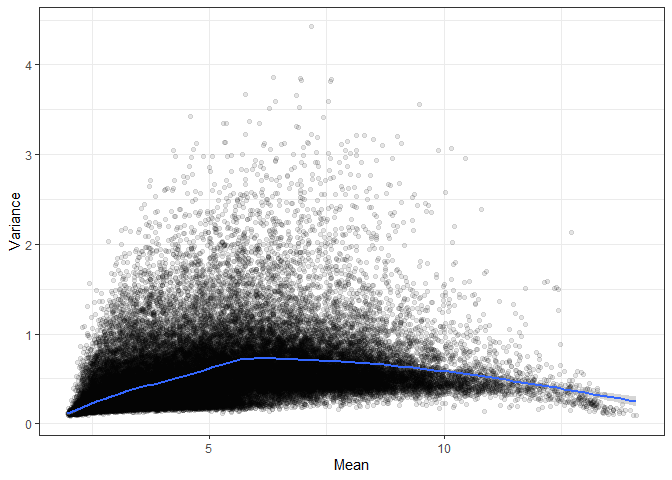
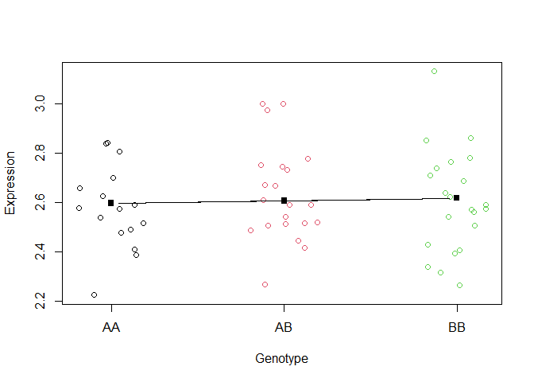

# STAT 540 - Seminar 11: eQTL analysis

## Acknowledgements

Contributors: Jasleen Grewal and Keegan Korthauer

## Learning objectives

By the end of this tutorial, you should be able to - Identify the goal
of an eQTL analysis - Explain the importance of log transforming the
expression data in an eQTL analysis - List the basic steps of an eQTL
analysis - Undertake a linear regression analysis for an eQTL study

## Dependencies

We will be using the following packages today. Follow instructions from
previous tutorials to install these if you don’t have them already.

``` r
library(GEOquery)
library(Biobase)
library(tidyverse)
theme_set(theme_bw())
library(knitr)
library(kableExtra)
```

## Introduction

As its name suggests (albeit in a roundabout way) Expression
Quantitative Trait Loci analysis, or eQTL analysis, aims to identify
associations between gene expression and genetic variation. eQTL
analysis is equivalent to a linear regression problem where we are
fitting our covariates (genetic variation data such as genotype) to
explain our outcome, the observed changes in gene expression.

Today, we will be working with genotype data (SNPs) and gene expression
values (counts) from a recently released dataset of melanoma cell lines.
In this [study](https://www.nature.com/articles/ng.3927), authors were
interested in identifying genes whose expression levels are correlated
with common variants in melanomas.

## Explore GSE99221

In this seminar, we are going to perform cis-eQTL analysis for 59
melanoma cell line samples, hence we will only be concerned with
variants within 1 Mb (1e6 base-pairs) away from the Transcription Start
Site (TSS) of each gene, where the vast majority of such associations
are found. The gene expression data we will be using is from GEO
accession
[GSE78995](https://www.ncbi.nlm.nih.gov/geo/query/acc.cgi?acc=GSE78995),
and the genotype data will be from GEO accession GSE99193. These two
datasets are from the same study, and can also be jointly downloaded
from the accession GSE99221.

The datasets we are going to use are:

  - GSE78995, which contains expression data (54675 features,
    i.e. rows), for 59 melanoma cell line samples. Note that the
    expression data is measured by Affymetrix Human Genome U133 Plus 2.0
    Array, and has already been normalized with RMA (robust microarray
    average) which involves a log2 transformation as well.

  - GSE99193, which contains genotype data (733202 SNPs, i.e. rows) for
    67 melanoma cell lines, measured by the Illumina Infinium human
    OmniExpress array

First, let’s retrieve our datasets from GEO with `getGEO` from
`GEOquery` package. Note: this step may take a few minutes\!

We will extract our data and metadata from the objects we get from GEO.
We will also subset our genotype data to only include cell lines for
which we have expression data. And, **critically** make sure that the
samples are in the same order in both the expression data and SNP data.

``` r
# If you run into an issue while downloading the following data
Sys.setenv("VROOM_CONNECTION_SIZE" = 131072 * 5)
```

``` r
exprs_dat <- getGEO('GSE78995', getGPL = FALSE)
show(exprs_dat) ## 59 samples
```

    ## $GSE78995_series_matrix.txt.gz
    ## ExpressionSet (storageMode: lockedEnvironment)
    ## assayData: 54675 features, 59 samples 
    ##   element names: exprs 
    ## protocolData: none
    ## phenoData
    ##   sampleNames: GSM2083256 GSM2083257 ... GSM2083314 (59 total)
    ##   varLabels: title geo_accession ... tissue:ch1 (34 total)
    ##   varMetadata: labelDescription
    ## featureData: none
    ## experimentData: use 'experimentData(object)'
    ##   pubMedIds: 28759004 
    ## Annotation: GPL570

``` r
genotype_dat <- getGEO('GSE99193', getGPL = FALSE)
show(genotype_dat) ## 67 samples
```

    ## $GSE99193_series_matrix.txt.gz
    ## ExpressionSet (storageMode: lockedEnvironment)
    ## assayData: 733202 features, 67 samples 
    ##   element names: exprs 
    ## protocolData: none
    ## phenoData
    ##   sampleNames: GSM2635493 GSM2635494 ... GSM2635559 (67 total)
    ##   varLabels: title geo_accession ... tissue:ch1 (36 total)
    ##   varMetadata: labelDescription
    ## featureData: none
    ## experimentData: use 'experimentData(object)'
    ##   pubMedIds: 28759004 
    ## Annotation: GPL13135

``` r
# Extract expression matrices (turn into data frames at once)
exprsdat <- as.data.frame(exprs(exprs_dat[[1]]))
genodat <- as.data.frame(exprs(genotype_dat[[1]]))

# Obtain the meta-data for the samples
exprs.meta <- pData(phenoData(exprs_dat[[1]]))
geno.meta <- pData(phenoData(genotype_dat[[1]]))

# Get the cell line labels for both types of data
exprs.meta$cell_line = gsub(".*UACC) melanoma ", "", exprs.meta$title)
geno.meta$cell_line = gsub(".*UACC ", "", geno.meta$title)

# Subset genotype data to keep cases overlapping with expression data
geno.meta.clean = geno.meta[geno.meta$cell_line %in% exprs.meta$cell_line,]
genodat.clean = genodat[,geno.meta.clean$geo_accession]

# reorder genotype data to match expression data (CRITICAL STEP)
x <- match(exprs.meta$cell_line, geno.meta.clean$cell_line)
geno.meta.clean <- geno.meta.clean[x,]
genodat.clean <- genodat.clean[,x]
```

Let us update the column names so that the samples are defined by the
cell line, and not by the GSM IDs (the latter are specific to the
submission sample and data type, so will not overlap between the SNP and
expression data).

``` r
colnames(exprsdat) = exprs.meta[exprs.meta$geo_accession == colnames(exprsdat),
                                c("cell_line")]
colnames(genodat.clean) = geno.meta.clean[geno.meta.clean$geo_accession == colnames(genodat.clean),
                                          c("cell_line")]
head(exprsdat) %>% kable() %>% kable_styling()
```

<table class="table" style="margin-left: auto; margin-right: auto;">

<thead>

<tr>

<th style="text-align:left;">

</th>

<th style="text-align:right;">

cell line 1093

</th>

<th style="text-align:right;">

cell line 1097

</th>

<th style="text-align:right;">

cell line 1113

</th>

<th style="text-align:right;">

cell line 1118

</th>

<th style="text-align:right;">

cell line 1120

</th>

<th style="text-align:right;">

cell line 1190

</th>

<th style="text-align:right;">

cell line 1237

</th>

<th style="text-align:right;">

cell line 1241

</th>

<th style="text-align:right;">

cell line 1265

</th>

<th style="text-align:right;">

cell line 1308

</th>

<th style="text-align:right;">

cell line 1316

</th>

<th style="text-align:right;">

cell line 1389

</th>

<th style="text-align:right;">

cell line 1451

</th>

<th style="text-align:right;">

cell line 1509

</th>

<th style="text-align:right;">

cell line 1592

</th>

<th style="text-align:right;">

cell line 1649

</th>

<th style="text-align:right;">

cell line 1729

</th>

<th style="text-align:right;">

cell line 1816

</th>

<th style="text-align:right;">

cell line 1940

</th>

<th style="text-align:right;">

cell line 2331

</th>

<th style="text-align:right;">

cell line 2404

</th>

<th style="text-align:right;">

cell line 2427

</th>

<th style="text-align:right;">

cell line 2496

</th>

<th style="text-align:right;">

cell line 2512

</th>

<th style="text-align:right;">

cell line 2528

</th>

<th style="text-align:right;">

cell line 2534

</th>

<th style="text-align:right;">

cell line 2545

</th>

<th style="text-align:right;">

cell line 257

</th>

<th style="text-align:right;">

cell line 2610

</th>

<th style="text-align:right;">

cell line 2641

</th>

<th style="text-align:right;">

cell line 2659

</th>

<th style="text-align:right;">

cell line 2837

</th>

<th style="text-align:right;">

cell line 285

</th>

<th style="text-align:right;">

cell line 2851

</th>

<th style="text-align:right;">

cell line 2876

</th>

<th style="text-align:right;">

cell line 2972

</th>

<th style="text-align:right;">

cell line 2993

</th>

<th style="text-align:right;">

cell line 2994

</th>

<th style="text-align:right;">

cell line 3074

</th>

<th style="text-align:right;">

cell line 3090

</th>

<th style="text-align:right;">

cell line 3093

</th>

<th style="text-align:right;">

cell line 3211

</th>

<th style="text-align:right;">

cell line 3291

</th>

<th style="text-align:right;">

cell line 3312

</th>

<th style="text-align:right;">

cell line 3337

</th>

<th style="text-align:right;">

cell line 3361

</th>

<th style="text-align:right;">

cell line 3379

</th>

<th style="text-align:right;">

cell line 3395

</th>

<th style="text-align:right;">

cell line 383

</th>

<th style="text-align:right;">

cell line 457

</th>

<th style="text-align:right;">

cell line 502

</th>

<th style="text-align:right;">

cell line 558

</th>

<th style="text-align:right;">

cell line 612

</th>

<th style="text-align:right;">

cell line 62

</th>

<th style="text-align:right;">

cell line 827

</th>

<th style="text-align:right;">

cell line 903

</th>

<th style="text-align:right;">

cell line 91

</th>

<th style="text-align:right;">

cell line 929

</th>

<th style="text-align:right;">

cell line 952

</th>

</tr>

</thead>

<tbody>

<tr>

<td style="text-align:left;">

1007\_s\_at

</td>

<td style="text-align:right;">

8.638036

</td>

<td style="text-align:right;">

9.569502

</td>

<td style="text-align:right;">

8.888012

</td>

<td style="text-align:right;">

8.997548

</td>

<td style="text-align:right;">

8.178419

</td>

<td style="text-align:right;">

9.859501

</td>

<td style="text-align:right;">

9.899436

</td>

<td style="text-align:right;">

8.958769

</td>

<td style="text-align:right;">

9.981231

</td>

<td style="text-align:right;">

9.221468

</td>

<td style="text-align:right;">

9.122782

</td>

<td style="text-align:right;">

10.083248

</td>

<td style="text-align:right;">

9.527601

</td>

<td style="text-align:right;">

9.352663

</td>

<td style="text-align:right;">

10.391349

</td>

<td style="text-align:right;">

9.354233

</td>

<td style="text-align:right;">

8.488048

</td>

<td style="text-align:right;">

8.700209

</td>

<td style="text-align:right;">

8.724595

</td>

<td style="text-align:right;">

11.229636

</td>

<td style="text-align:right;">

9.484369

</td>

<td style="text-align:right;">

8.242250

</td>

<td style="text-align:right;">

7.333083

</td>

<td style="text-align:right;">

9.041875

</td>

<td style="text-align:right;">

9.019678

</td>

<td style="text-align:right;">

10.563816

</td>

<td style="text-align:right;">

7.535070

</td>

<td style="text-align:right;">

8.589149

</td>

<td style="text-align:right;">

8.666304

</td>

<td style="text-align:right;">

10.145057

</td>

<td style="text-align:right;">

11.024141

</td>

<td style="text-align:right;">

9.821123

</td>

<td style="text-align:right;">

9.266064

</td>

<td style="text-align:right;">

9.292188

</td>

<td style="text-align:right;">

8.882724

</td>

<td style="text-align:right;">

10.528187

</td>

<td style="text-align:right;">

8.468762

</td>

<td style="text-align:right;">

9.566095

</td>

<td style="text-align:right;">

8.948761

</td>

<td style="text-align:right;">

9.549295

</td>

<td style="text-align:right;">

9.317864

</td>

<td style="text-align:right;">

8.611362

</td>

<td style="text-align:right;">

9.429071

</td>

<td style="text-align:right;">

9.057645

</td>

<td style="text-align:right;">

10.177045

</td>

<td style="text-align:right;">

8.626289

</td>

<td style="text-align:right;">

9.654319

</td>

<td style="text-align:right;">

9.946739

</td>

<td style="text-align:right;">

9.475134

</td>

<td style="text-align:right;">

10.056217

</td>

<td style="text-align:right;">

8.908891

</td>

<td style="text-align:right;">

9.289914

</td>

<td style="text-align:right;">

8.095805

</td>

<td style="text-align:right;">

9.475180

</td>

<td style="text-align:right;">

9.815099

</td>

<td style="text-align:right;">

9.532179

</td>

<td style="text-align:right;">

9.156111

</td>

<td style="text-align:right;">

8.128645

</td>

<td style="text-align:right;">

8.760415

</td>

</tr>

<tr>

<td style="text-align:left;">

1053\_at

</td>

<td style="text-align:right;">

6.511082

</td>

<td style="text-align:right;">

6.892053

</td>

<td style="text-align:right;">

8.098704

</td>

<td style="text-align:right;">

7.318858

</td>

<td style="text-align:right;">

8.104367

</td>

<td style="text-align:right;">

6.097134

</td>

<td style="text-align:right;">

8.022223

</td>

<td style="text-align:right;">

7.538899

</td>

<td style="text-align:right;">

7.382145

</td>

<td style="text-align:right;">

6.880304

</td>

<td style="text-align:right;">

7.634117

</td>

<td style="text-align:right;">

7.819483

</td>

<td style="text-align:right;">

7.079510

</td>

<td style="text-align:right;">

6.808387

</td>

<td style="text-align:right;">

6.723331

</td>

<td style="text-align:right;">

7.317578

</td>

<td style="text-align:right;">

6.516934

</td>

<td style="text-align:right;">

7.164454

</td>

<td style="text-align:right;">

7.694599

</td>

<td style="text-align:right;">

7.490678

</td>

<td style="text-align:right;">

6.644928

</td>

<td style="text-align:right;">

7.748965

</td>

<td style="text-align:right;">

7.904377

</td>

<td style="text-align:right;">

7.353012

</td>

<td style="text-align:right;">

7.516102

</td>

<td style="text-align:right;">

6.507049

</td>

<td style="text-align:right;">

6.705707

</td>

<td style="text-align:right;">

7.289198

</td>

<td style="text-align:right;">

8.208734

</td>

<td style="text-align:right;">

7.020544

</td>

<td style="text-align:right;">

6.743984

</td>

<td style="text-align:right;">

7.272101

</td>

<td style="text-align:right;">

8.113513

</td>

<td style="text-align:right;">

7.254123

</td>

<td style="text-align:right;">

7.835481

</td>

<td style="text-align:right;">

6.879287

</td>

<td style="text-align:right;">

8.003466

</td>

<td style="text-align:right;">

7.152403

</td>

<td style="text-align:right;">

7.180104

</td>

<td style="text-align:right;">

9.171832

</td>

<td style="text-align:right;">

6.407972

</td>

<td style="text-align:right;">

6.962079

</td>

<td style="text-align:right;">

7.729556

</td>

<td style="text-align:right;">

7.253038

</td>

<td style="text-align:right;">

7.756037

</td>

<td style="text-align:right;">

7.754817

</td>

<td style="text-align:right;">

7.812666

</td>

<td style="text-align:right;">

7.568846

</td>

<td style="text-align:right;">

8.156207

</td>

<td style="text-align:right;">

7.818405

</td>

<td style="text-align:right;">

7.735215

</td>

<td style="text-align:right;">

6.696510

</td>

<td style="text-align:right;">

8.567920

</td>

<td style="text-align:right;">

6.729650

</td>

<td style="text-align:right;">

7.401750

</td>

<td style="text-align:right;">

7.134959

</td>

<td style="text-align:right;">

8.330609

</td>

<td style="text-align:right;">

7.626840

</td>

<td style="text-align:right;">

7.060035

</td>

</tr>

<tr>

<td style="text-align:left;">

117\_at

</td>

<td style="text-align:right;">

4.752166

</td>

<td style="text-align:right;">

3.686001

</td>

<td style="text-align:right;">

4.510261

</td>

<td style="text-align:right;">

5.359558

</td>

<td style="text-align:right;">

4.185034

</td>

<td style="text-align:right;">

4.959753

</td>

<td style="text-align:right;">

3.914128

</td>

<td style="text-align:right;">

3.913718

</td>

<td style="text-align:right;">

4.688048

</td>

<td style="text-align:right;">

4.955991

</td>

<td style="text-align:right;">

3.910185

</td>

<td style="text-align:right;">

4.336408

</td>

<td style="text-align:right;">

4.490547

</td>

<td style="text-align:right;">

4.775587

</td>

<td style="text-align:right;">

4.089210

</td>

<td style="text-align:right;">

4.427098

</td>

<td style="text-align:right;">

3.797345

</td>

<td style="text-align:right;">

4.715663

</td>

<td style="text-align:right;">

5.148917

</td>

<td style="text-align:right;">

3.828924

</td>

<td style="text-align:right;">

3.713938

</td>

<td style="text-align:right;">

6.269204

</td>

<td style="text-align:right;">

3.730159

</td>

<td style="text-align:right;">

4.536183

</td>

<td style="text-align:right;">

4.103633

</td>

<td style="text-align:right;">

4.191025

</td>

<td style="text-align:right;">

4.603317

</td>

<td style="text-align:right;">

4.881486

</td>

<td style="text-align:right;">

4.873805

</td>

<td style="text-align:right;">

3.955486

</td>

<td style="text-align:right;">

4.291414

</td>

<td style="text-align:right;">

4.266460

</td>

<td style="text-align:right;">

4.735696

</td>

<td style="text-align:right;">

4.414866

</td>

<td style="text-align:right;">

3.681968

</td>

<td style="text-align:right;">

4.723171

</td>

<td style="text-align:right;">

4.283983

</td>

<td style="text-align:right;">

4.178583

</td>

<td style="text-align:right;">

3.934642

</td>

<td style="text-align:right;">

6.120346

</td>

<td style="text-align:right;">

4.916537

</td>

<td style="text-align:right;">

4.229331

</td>

<td style="text-align:right;">

5.039042

</td>

<td style="text-align:right;">

4.035960

</td>

<td style="text-align:right;">

5.249714

</td>

<td style="text-align:right;">

5.744336

</td>

<td style="text-align:right;">

3.888232

</td>

<td style="text-align:right;">

4.437059

</td>

<td style="text-align:right;">

4.400191

</td>

<td style="text-align:right;">

4.417484

</td>

<td style="text-align:right;">

4.033891

</td>

<td style="text-align:right;">

4.179866

</td>

<td style="text-align:right;">

3.844249

</td>

<td style="text-align:right;">

4.551650

</td>

<td style="text-align:right;">

4.900716

</td>

<td style="text-align:right;">

4.330514

</td>

<td style="text-align:right;">

4.796757

</td>

<td style="text-align:right;">

6.677047

</td>

<td style="text-align:right;">

3.989919

</td>

</tr>

<tr>

<td style="text-align:left;">

121\_at

</td>

<td style="text-align:right;">

7.280487

</td>

<td style="text-align:right;">

6.960408

</td>

<td style="text-align:right;">

7.167364

</td>

<td style="text-align:right;">

7.196955

</td>

<td style="text-align:right;">

6.918797

</td>

<td style="text-align:right;">

7.088626

</td>

<td style="text-align:right;">

6.761861

</td>

<td style="text-align:right;">

7.450579

</td>

<td style="text-align:right;">

7.065914

</td>

<td style="text-align:right;">

6.822917

</td>

<td style="text-align:right;">

6.759347

</td>

<td style="text-align:right;">

7.096096

</td>

<td style="text-align:right;">

7.640705

</td>

<td style="text-align:right;">

7.068972

</td>

<td style="text-align:right;">

6.526180

</td>

<td style="text-align:right;">

6.708067

</td>

<td style="text-align:right;">

7.109364

</td>

<td style="text-align:right;">

7.210015

</td>

<td style="text-align:right;">

6.337690

</td>

<td style="text-align:right;">

7.372803

</td>

<td style="text-align:right;">

6.780501

</td>

<td style="text-align:right;">

7.556065

</td>

<td style="text-align:right;">

7.471491

</td>

<td style="text-align:right;">

6.992312

</td>

<td style="text-align:right;">

7.629332

</td>

<td style="text-align:right;">

7.217674

</td>

<td style="text-align:right;">

7.154515

</td>

<td style="text-align:right;">

6.836663

</td>

<td style="text-align:right;">

7.323042

</td>

<td style="text-align:right;">

7.231007

</td>

<td style="text-align:right;">

7.002526

</td>

<td style="text-align:right;">

6.777624

</td>

<td style="text-align:right;">

7.242775

</td>

<td style="text-align:right;">

7.603851

</td>

<td style="text-align:right;">

6.653988

</td>

<td style="text-align:right;">

7.324272

</td>

<td style="text-align:right;">

6.940816

</td>

<td style="text-align:right;">

6.624049

</td>

<td style="text-align:right;">

6.879138

</td>

<td style="text-align:right;">

7.187866

</td>

<td style="text-align:right;">

7.087906

</td>

<td style="text-align:right;">

6.828678

</td>

<td style="text-align:right;">

6.994734

</td>

<td style="text-align:right;">

6.815146

</td>

<td style="text-align:right;">

7.243580

</td>

<td style="text-align:right;">

7.250607

</td>

<td style="text-align:right;">

6.636049

</td>

<td style="text-align:right;">

6.977882

</td>

<td style="text-align:right;">

6.795325

</td>

<td style="text-align:right;">

7.071736

</td>

<td style="text-align:right;">

7.133528

</td>

<td style="text-align:right;">

6.642631

</td>

<td style="text-align:right;">

6.685315

</td>

<td style="text-align:right;">

6.757389

</td>

<td style="text-align:right;">

6.831284

</td>

<td style="text-align:right;">

7.469521

</td>

<td style="text-align:right;">

6.715281

</td>

<td style="text-align:right;">

7.027035

</td>

<td style="text-align:right;">

7.648609

</td>

</tr>

<tr>

<td style="text-align:left;">

1255\_g\_at

</td>

<td style="text-align:right;">

2.259491

</td>

<td style="text-align:right;">

2.371965

</td>

<td style="text-align:right;">

2.283499

</td>

<td style="text-align:right;">

2.186442

</td>

<td style="text-align:right;">

2.455879

</td>

<td style="text-align:right;">

2.296577

</td>

<td style="text-align:right;">

2.333483

</td>

<td style="text-align:right;">

2.229012

</td>

<td style="text-align:right;">

2.468397

</td>

<td style="text-align:right;">

2.530879

</td>

<td style="text-align:right;">

2.300941

</td>

<td style="text-align:right;">

2.558433

</td>

<td style="text-align:right;">

2.378130

</td>

<td style="text-align:right;">

2.354706

</td>

<td style="text-align:right;">

2.276999

</td>

<td style="text-align:right;">

2.288279

</td>

<td style="text-align:right;">

2.305138

</td>

<td style="text-align:right;">

2.326907

</td>

<td style="text-align:right;">

2.256450

</td>

<td style="text-align:right;">

2.436730

</td>

<td style="text-align:right;">

2.426354

</td>

<td style="text-align:right;">

2.398398

</td>

<td style="text-align:right;">

2.214872

</td>

<td style="text-align:right;">

2.288419

</td>

<td style="text-align:right;">

2.201610

</td>

<td style="text-align:right;">

2.594016

</td>

<td style="text-align:right;">

2.590422

</td>

<td style="text-align:right;">

2.349674

</td>

<td style="text-align:right;">

2.370590

</td>

<td style="text-align:right;">

2.183665

</td>

<td style="text-align:right;">

2.458047

</td>

<td style="text-align:right;">

2.335073

</td>

<td style="text-align:right;">

2.265239

</td>

<td style="text-align:right;">

2.175599

</td>

<td style="text-align:right;">

2.254122

</td>

<td style="text-align:right;">

2.452293

</td>

<td style="text-align:right;">

2.496869

</td>

<td style="text-align:right;">

2.209466

</td>

<td style="text-align:right;">

2.486782

</td>

<td style="text-align:right;">

2.334564

</td>

<td style="text-align:right;">

2.888266

</td>

<td style="text-align:right;">

2.285354

</td>

<td style="text-align:right;">

2.257714

</td>

<td style="text-align:right;">

2.269391

</td>

<td style="text-align:right;">

2.325922

</td>

<td style="text-align:right;">

2.352795

</td>

<td style="text-align:right;">

2.402064

</td>

<td style="text-align:right;">

2.307650

</td>

<td style="text-align:right;">

2.339831

</td>

<td style="text-align:right;">

2.344689

</td>

<td style="text-align:right;">

2.345543

</td>

<td style="text-align:right;">

2.279138

</td>

<td style="text-align:right;">

2.111807

</td>

<td style="text-align:right;">

2.485640

</td>

<td style="text-align:right;">

2.263299

</td>

<td style="text-align:right;">

2.255623

</td>

<td style="text-align:right;">

2.328615

</td>

<td style="text-align:right;">

2.374157

</td>

<td style="text-align:right;">

2.480321

</td>

</tr>

<tr>

<td style="text-align:left;">

1294\_at

</td>

<td style="text-align:right;">

5.551776

</td>

<td style="text-align:right;">

5.444600

</td>

<td style="text-align:right;">

6.927450

</td>

<td style="text-align:right;">

4.722336

</td>

<td style="text-align:right;">

5.955897

</td>

<td style="text-align:right;">

6.184568

</td>

<td style="text-align:right;">

7.191890

</td>

<td style="text-align:right;">

6.336652

</td>

<td style="text-align:right;">

6.620428

</td>

<td style="text-align:right;">

7.708175

</td>

<td style="text-align:right;">

6.677614

</td>

<td style="text-align:right;">

6.157961

</td>

<td style="text-align:right;">

6.710778

</td>

<td style="text-align:right;">

7.012948

</td>

<td style="text-align:right;">

6.223337

</td>

<td style="text-align:right;">

6.707393

</td>

<td style="text-align:right;">

7.905926

</td>

<td style="text-align:right;">

4.735737

</td>

<td style="text-align:right;">

5.643904

</td>

<td style="text-align:right;">

7.199911

</td>

<td style="text-align:right;">

7.790508

</td>

<td style="text-align:right;">

5.140462

</td>

<td style="text-align:right;">

6.090006

</td>

<td style="text-align:right;">

7.240944

</td>

<td style="text-align:right;">

7.357003

</td>

<td style="text-align:right;">

6.679847

</td>

<td style="text-align:right;">

4.981623

</td>

<td style="text-align:right;">

5.547245

</td>

<td style="text-align:right;">

6.045961

</td>

<td style="text-align:right;">

6.541726

</td>

<td style="text-align:right;">

6.511393

</td>

<td style="text-align:right;">

8.520112

</td>

<td style="text-align:right;">

6.335275

</td>

<td style="text-align:right;">

7.653637

</td>

<td style="text-align:right;">

6.733077

</td>

<td style="text-align:right;">

5.250051

</td>

<td style="text-align:right;">

7.434904

</td>

<td style="text-align:right;">

6.133121

</td>

<td style="text-align:right;">

6.782157

</td>

<td style="text-align:right;">

6.521575

</td>

<td style="text-align:right;">

6.669553

</td>

<td style="text-align:right;">

6.330201

</td>

<td style="text-align:right;">

6.020764

</td>

<td style="text-align:right;">

5.926245

</td>

<td style="text-align:right;">

5.954995

</td>

<td style="text-align:right;">

6.999129

</td>

<td style="text-align:right;">

5.529070

</td>

<td style="text-align:right;">

6.338303

</td>

<td style="text-align:right;">

6.457639

</td>

<td style="text-align:right;">

5.197230

</td>

<td style="text-align:right;">

7.151159

</td>

<td style="text-align:right;">

6.776002

</td>

<td style="text-align:right;">

6.211269

</td>

<td style="text-align:right;">

6.069893

</td>

<td style="text-align:right;">

5.939545

</td>

<td style="text-align:right;">

6.155424

</td>

<td style="text-align:right;">

4.762139

</td>

<td style="text-align:right;">

5.274493

</td>

<td style="text-align:right;">

7.095326

</td>

</tr>

</tbody>

</table>

``` r
head(genodat.clean) %>% kable() %>% kable_styling()
```

<table class="table" style="margin-left: auto; margin-right: auto;">

<thead>

<tr>

<th style="text-align:left;">

</th>

<th style="text-align:left;">

cell line 1093

</th>

<th style="text-align:left;">

cell line 1097

</th>

<th style="text-align:left;">

cell line 1113

</th>

<th style="text-align:left;">

cell line 1118

</th>

<th style="text-align:left;">

cell line 1120

</th>

<th style="text-align:left;">

cell line 1190

</th>

<th style="text-align:left;">

cell line 1237

</th>

<th style="text-align:left;">

cell line 1241

</th>

<th style="text-align:left;">

cell line 1265

</th>

<th style="text-align:left;">

cell line 1308

</th>

<th style="text-align:left;">

cell line 1316

</th>

<th style="text-align:left;">

cell line 1389

</th>

<th style="text-align:left;">

cell line 1451

</th>

<th style="text-align:left;">

cell line 1509

</th>

<th style="text-align:left;">

cell line 1592

</th>

<th style="text-align:left;">

cell line 1649

</th>

<th style="text-align:left;">

cell line 1729

</th>

<th style="text-align:left;">

cell line 1816

</th>

<th style="text-align:left;">

cell line 1940

</th>

<th style="text-align:left;">

cell line 2331

</th>

<th style="text-align:left;">

cell line 2404

</th>

<th style="text-align:left;">

cell line 2427

</th>

<th style="text-align:left;">

cell line 2496

</th>

<th style="text-align:left;">

cell line 2512

</th>

<th style="text-align:left;">

cell line 2528

</th>

<th style="text-align:left;">

cell line 2534

</th>

<th style="text-align:left;">

cell line 2545

</th>

<th style="text-align:left;">

cell line 257

</th>

<th style="text-align:left;">

cell line 2610

</th>

<th style="text-align:left;">

cell line 2641

</th>

<th style="text-align:left;">

cell line 2659

</th>

<th style="text-align:left;">

cell line 2837

</th>

<th style="text-align:left;">

cell line 285

</th>

<th style="text-align:left;">

cell line 2851

</th>

<th style="text-align:left;">

cell line 2876

</th>

<th style="text-align:left;">

cell line 2972

</th>

<th style="text-align:left;">

cell line 2993

</th>

<th style="text-align:left;">

cell line 2994

</th>

<th style="text-align:left;">

cell line 3074

</th>

<th style="text-align:left;">

cell line 3090

</th>

<th style="text-align:left;">

cell line 3093

</th>

<th style="text-align:left;">

cell line 3211

</th>

<th style="text-align:left;">

cell line 3291

</th>

<th style="text-align:left;">

cell line 3312

</th>

<th style="text-align:left;">

cell line 3337

</th>

<th style="text-align:left;">

cell line 3361

</th>

<th style="text-align:left;">

cell line 3379

</th>

<th style="text-align:left;">

cell line 3395

</th>

<th style="text-align:left;">

cell line 383

</th>

<th style="text-align:left;">

cell line 457

</th>

<th style="text-align:left;">

cell line 502

</th>

<th style="text-align:left;">

cell line 558

</th>

<th style="text-align:left;">

cell line 612

</th>

<th style="text-align:left;">

cell line 62

</th>

<th style="text-align:left;">

cell line 827

</th>

<th style="text-align:left;">

cell line 903

</th>

<th style="text-align:left;">

cell line 91

</th>

<th style="text-align:left;">

cell line 929

</th>

<th style="text-align:left;">

cell line 952

</th>

</tr>

</thead>

<tbody>

<tr>

<td style="text-align:left;">

rs1000000

</td>

<td style="text-align:left;">

AB

</td>

<td style="text-align:left;">

BB

</td>

<td style="text-align:left;">

BB

</td>

<td style="text-align:left;">

BB

</td>

<td style="text-align:left;">

BB

</td>

<td style="text-align:left;">

BB

</td>

<td style="text-align:left;">

AA

</td>

<td style="text-align:left;">

AB

</td>

<td style="text-align:left;">

AA

</td>

<td style="text-align:left;">

AA

</td>

<td style="text-align:left;">

BB

</td>

<td style="text-align:left;">

AB

</td>

<td style="text-align:left;">

AB

</td>

<td style="text-align:left;">

BB

</td>

<td style="text-align:left;">

AB

</td>

<td style="text-align:left;">

BB

</td>

<td style="text-align:left;">

AB

</td>

<td style="text-align:left;">

BB

</td>

<td style="text-align:left;">

AB

</td>

<td style="text-align:left;">

BB

</td>

<td style="text-align:left;">

BB

</td>

<td style="text-align:left;">

BB

</td>

<td style="text-align:left;">

BB

</td>

<td style="text-align:left;">

BB

</td>

<td style="text-align:left;">

BB

</td>

<td style="text-align:left;">

AB

</td>

<td style="text-align:left;">

BB

</td>

<td style="text-align:left;">

BB

</td>

<td style="text-align:left;">

BB

</td>

<td style="text-align:left;">

BB

</td>

<td style="text-align:left;">

BB

</td>

<td style="text-align:left;">

AB

</td>

<td style="text-align:left;">

AB

</td>

<td style="text-align:left;">

BB

</td>

<td style="text-align:left;">

AB

</td>

<td style="text-align:left;">

BB

</td>

<td style="text-align:left;">

BB

</td>

<td style="text-align:left;">

AA

</td>

<td style="text-align:left;">

BB

</td>

<td style="text-align:left;">

BB

</td>

<td style="text-align:left;">

BB

</td>

<td style="text-align:left;">

BB

</td>

<td style="text-align:left;">

BB

</td>

<td style="text-align:left;">

BB

</td>

<td style="text-align:left;">

BB

</td>

<td style="text-align:left;">

BB

</td>

<td style="text-align:left;">

AB

</td>

<td style="text-align:left;">

BB

</td>

<td style="text-align:left;">

BB

</td>

<td style="text-align:left;">

BB

</td>

<td style="text-align:left;">

AA

</td>

<td style="text-align:left;">

BB

</td>

<td style="text-align:left;">

BB

</td>

<td style="text-align:left;">

BB

</td>

<td style="text-align:left;">

BB

</td>

<td style="text-align:left;">

BB

</td>

<td style="text-align:left;">

BB

</td>

<td style="text-align:left;">

AA

</td>

<td style="text-align:left;">

AB

</td>

</tr>

<tr>

<td style="text-align:left;">

rs1000002

</td>

<td style="text-align:left;">

BB

</td>

<td style="text-align:left;">

BB

</td>

<td style="text-align:left;">

BB

</td>

<td style="text-align:left;">

AA

</td>

<td style="text-align:left;">

AB

</td>

<td style="text-align:left;">

NC

</td>

<td style="text-align:left;">

AB

</td>

<td style="text-align:left;">

AB

</td>

<td style="text-align:left;">

BB

</td>

<td style="text-align:left;">

AA

</td>

<td style="text-align:left;">

AA

</td>

<td style="text-align:left;">

AB

</td>

<td style="text-align:left;">

AB

</td>

<td style="text-align:left;">

AB

</td>

<td style="text-align:left;">

AB

</td>

<td style="text-align:left;">

AB

</td>

<td style="text-align:left;">

AA

</td>

<td style="text-align:left;">

AA

</td>

<td style="text-align:left;">

AB

</td>

<td style="text-align:left;">

AB

</td>

<td style="text-align:left;">

AB

</td>

<td style="text-align:left;">

BB

</td>

<td style="text-align:left;">

BB

</td>

<td style="text-align:left;">

AB

</td>

<td style="text-align:left;">

AB

</td>

<td style="text-align:left;">

AB

</td>

<td style="text-align:left;">

BB

</td>

<td style="text-align:left;">

AA

</td>

<td style="text-align:left;">

AB

</td>

<td style="text-align:left;">

AA

</td>

<td style="text-align:left;">

BB

</td>

<td style="text-align:left;">

BB

</td>

<td style="text-align:left;">

AA

</td>

<td style="text-align:left;">

BB

</td>

<td style="text-align:left;">

BB

</td>

<td style="text-align:left;">

BB

</td>

<td style="text-align:left;">

AB

</td>

<td style="text-align:left;">

AA

</td>

<td style="text-align:left;">

AA

</td>

<td style="text-align:left;">

AA

</td>

<td style="text-align:left;">

AB

</td>

<td style="text-align:left;">

AB

</td>

<td style="text-align:left;">

AA

</td>

<td style="text-align:left;">

AA

</td>

<td style="text-align:left;">

AA

</td>

<td style="text-align:left;">

BB

</td>

<td style="text-align:left;">

BB

</td>

<td style="text-align:left;">

AA

</td>

<td style="text-align:left;">

BB

</td>

<td style="text-align:left;">

AB

</td>

<td style="text-align:left;">

AB

</td>

<td style="text-align:left;">

AA

</td>

<td style="text-align:left;">

BB

</td>

<td style="text-align:left;">

AB

</td>

<td style="text-align:left;">

BB

</td>

<td style="text-align:left;">

BB

</td>

<td style="text-align:left;">

BB

</td>

<td style="text-align:left;">

AB

</td>

<td style="text-align:left;">

AB

</td>

</tr>

<tr>

<td style="text-align:left;">

rs10000023

</td>

<td style="text-align:left;">

AA

</td>

<td style="text-align:left;">

AB

</td>

<td style="text-align:left;">

AA

</td>

<td style="text-align:left;">

AB

</td>

<td style="text-align:left;">

AB

</td>

<td style="text-align:left;">

BB

</td>

<td style="text-align:left;">

AA

</td>

<td style="text-align:left;">

BB

</td>

<td style="text-align:left;">

AA

</td>

<td style="text-align:left;">

AB

</td>

<td style="text-align:left;">

AB

</td>

<td style="text-align:left;">

BB

</td>

<td style="text-align:left;">

AB

</td>

<td style="text-align:left;">

AB

</td>

<td style="text-align:left;">

AB

</td>

<td style="text-align:left;">

AB

</td>

<td style="text-align:left;">

AA

</td>

<td style="text-align:left;">

AA

</td>

<td style="text-align:left;">

AA

</td>

<td style="text-align:left;">

AA

</td>

<td style="text-align:left;">

AB

</td>

<td style="text-align:left;">

BB

</td>

<td style="text-align:left;">

BB

</td>

<td style="text-align:left;">

AB

</td>

<td style="text-align:left;">

BB

</td>

<td style="text-align:left;">

AA

</td>

<td style="text-align:left;">

AA

</td>

<td style="text-align:left;">

AA

</td>

<td style="text-align:left;">

BB

</td>

<td style="text-align:left;">

BB

</td>

<td style="text-align:left;">

BB

</td>

<td style="text-align:left;">

AA

</td>

<td style="text-align:left;">

AA

</td>

<td style="text-align:left;">

BB

</td>

<td style="text-align:left;">

AA

</td>

<td style="text-align:left;">

AA

</td>

<td style="text-align:left;">

AB

</td>

<td style="text-align:left;">

AA

</td>

<td style="text-align:left;">

AA

</td>

<td style="text-align:left;">

AA

</td>

<td style="text-align:left;">

AB

</td>

<td style="text-align:left;">

AA

</td>

<td style="text-align:left;">

AA

</td>

<td style="text-align:left;">

AB

</td>

<td style="text-align:left;">

AA

</td>

<td style="text-align:left;">

AB

</td>

<td style="text-align:left;">

NC

</td>

<td style="text-align:left;">

AA

</td>

<td style="text-align:left;">

BB

</td>

<td style="text-align:left;">

AA

</td>

<td style="text-align:left;">

AB

</td>

<td style="text-align:left;">

AB

</td>

<td style="text-align:left;">

AA

</td>

<td style="text-align:left;">

AA

</td>

<td style="text-align:left;">

AB

</td>

<td style="text-align:left;">

BB

</td>

<td style="text-align:left;">

BB

</td>

<td style="text-align:left;">

AB

</td>

<td style="text-align:left;">

AA

</td>

</tr>

<tr>

<td style="text-align:left;">

rs1000003

</td>

<td style="text-align:left;">

AA

</td>

<td style="text-align:left;">

AA

</td>

<td style="text-align:left;">

AA

</td>

<td style="text-align:left;">

AA

</td>

<td style="text-align:left;">

AA

</td>

<td style="text-align:left;">

AB

</td>

<td style="text-align:left;">

AB

</td>

<td style="text-align:left;">

AB

</td>

<td style="text-align:left;">

AA

</td>

<td style="text-align:left;">

AB

</td>

<td style="text-align:left;">

AA

</td>

<td style="text-align:left;">

AA

</td>

<td style="text-align:left;">

AA

</td>

<td style="text-align:left;">

BB

</td>

<td style="text-align:left;">

AB

</td>

<td style="text-align:left;">

AA

</td>

<td style="text-align:left;">

AA

</td>

<td style="text-align:left;">

AA

</td>

<td style="text-align:left;">

AB

</td>

<td style="text-align:left;">

AA

</td>

<td style="text-align:left;">

AA

</td>

<td style="text-align:left;">

AA

</td>

<td style="text-align:left;">

AA

</td>

<td style="text-align:left;">

AB

</td>

<td style="text-align:left;">

AA

</td>

<td style="text-align:left;">

AB

</td>

<td style="text-align:left;">

AA

</td>

<td style="text-align:left;">

AA

</td>

<td style="text-align:left;">

AA

</td>

<td style="text-align:left;">

AA

</td>

<td style="text-align:left;">

AB

</td>

<td style="text-align:left;">

AA

</td>

<td style="text-align:left;">

AB

</td>

<td style="text-align:left;">

AA

</td>

<td style="text-align:left;">

AA

</td>

<td style="text-align:left;">

AB

</td>

<td style="text-align:left;">

AA

</td>

<td style="text-align:left;">

AA

</td>

<td style="text-align:left;">

AB

</td>

<td style="text-align:left;">

BB

</td>

<td style="text-align:left;">

AA

</td>

<td style="text-align:left;">

AB

</td>

<td style="text-align:left;">

AA

</td>

<td style="text-align:left;">

AA

</td>

<td style="text-align:left;">

AB

</td>

<td style="text-align:left;">

AA

</td>

<td style="text-align:left;">

AB

</td>

<td style="text-align:left;">

BB

</td>

<td style="text-align:left;">

AA

</td>

<td style="text-align:left;">

AA

</td>

<td style="text-align:left;">

BB

</td>

<td style="text-align:left;">

AA

</td>

<td style="text-align:left;">

AA

</td>

<td style="text-align:left;">

AA

</td>

<td style="text-align:left;">

AA

</td>

<td style="text-align:left;">

AA

</td>

<td style="text-align:left;">

AA

</td>

<td style="text-align:left;">

AA

</td>

<td style="text-align:left;">

AA

</td>

</tr>

<tr>

<td style="text-align:left;">

rs10000030

</td>

<td style="text-align:left;">

BB

</td>

<td style="text-align:left;">

BB

</td>

<td style="text-align:left;">

BB

</td>

<td style="text-align:left;">

BB

</td>

<td style="text-align:left;">

BB

</td>

<td style="text-align:left;">

BB

</td>

<td style="text-align:left;">

NC

</td>

<td style="text-align:left;">

BB

</td>

<td style="text-align:left;">

BB

</td>

<td style="text-align:left;">

BB

</td>

<td style="text-align:left;">

BB

</td>

<td style="text-align:left;">

BB

</td>

<td style="text-align:left;">

NC

</td>

<td style="text-align:left;">

BB

</td>

<td style="text-align:left;">

BB

</td>

<td style="text-align:left;">

BB

</td>

<td style="text-align:left;">

BB

</td>

<td style="text-align:left;">

NC

</td>

<td style="text-align:left;">

BB

</td>

<td style="text-align:left;">

BB

</td>

<td style="text-align:left;">

BB

</td>

<td style="text-align:left;">

AB

</td>

<td style="text-align:left;">

BB

</td>

<td style="text-align:left;">

BB

</td>

<td style="text-align:left;">

BB

</td>

<td style="text-align:left;">

AB

</td>

<td style="text-align:left;">

BB

</td>

<td style="text-align:left;">

NC

</td>

<td style="text-align:left;">

BB

</td>

<td style="text-align:left;">

BB

</td>

<td style="text-align:left;">

BB

</td>

<td style="text-align:left;">

BB

</td>

<td style="text-align:left;">

BB

</td>

<td style="text-align:left;">

BB

</td>

<td style="text-align:left;">

BB

</td>

<td style="text-align:left;">

BB

</td>

<td style="text-align:left;">

BB

</td>

<td style="text-align:left;">

AB

</td>

<td style="text-align:left;">

BB

</td>

<td style="text-align:left;">

NC

</td>

<td style="text-align:left;">

BB

</td>

<td style="text-align:left;">

BB

</td>

<td style="text-align:left;">

BB

</td>

<td style="text-align:left;">

BB

</td>

<td style="text-align:left;">

BB

</td>

<td style="text-align:left;">

BB

</td>

<td style="text-align:left;">

BB

</td>

<td style="text-align:left;">

BB

</td>

<td style="text-align:left;">

BB

</td>

<td style="text-align:left;">

BB

</td>

<td style="text-align:left;">

BB

</td>

<td style="text-align:left;">

AB

</td>

<td style="text-align:left;">

NC

</td>

<td style="text-align:left;">

BB

</td>

<td style="text-align:left;">

AB

</td>

<td style="text-align:left;">

BB

</td>

<td style="text-align:left;">

BB

</td>

<td style="text-align:left;">

BB

</td>

<td style="text-align:left;">

BB

</td>

</tr>

<tr>

<td style="text-align:left;">

rs10000037

</td>

<td style="text-align:left;">

BB

</td>

<td style="text-align:left;">

AB

</td>

<td style="text-align:left;">

BB

</td>

<td style="text-align:left;">

AB

</td>

<td style="text-align:left;">

BB

</td>

<td style="text-align:left;">

BB

</td>

<td style="text-align:left;">

AA

</td>

<td style="text-align:left;">

BB

</td>

<td style="text-align:left;">

BB

</td>

<td style="text-align:left;">

BB

</td>

<td style="text-align:left;">

BB

</td>

<td style="text-align:left;">

AB

</td>

<td style="text-align:left;">

AB

</td>

<td style="text-align:left;">

AA

</td>

<td style="text-align:left;">

BB

</td>

<td style="text-align:left;">

AA

</td>

<td style="text-align:left;">

AB

</td>

<td style="text-align:left;">

BB

</td>

<td style="text-align:left;">

BB

</td>

<td style="text-align:left;">

BB

</td>

<td style="text-align:left;">

BB

</td>

<td style="text-align:left;">

AB

</td>

<td style="text-align:left;">

BB

</td>

<td style="text-align:left;">

AA

</td>

<td style="text-align:left;">

AB

</td>

<td style="text-align:left;">

AA

</td>

<td style="text-align:left;">

BB

</td>

<td style="text-align:left;">

BB

</td>

<td style="text-align:left;">

BB

</td>

<td style="text-align:left;">

BB

</td>

<td style="text-align:left;">

BB

</td>

<td style="text-align:left;">

BB

</td>

<td style="text-align:left;">

BB

</td>

<td style="text-align:left;">

AB

</td>

<td style="text-align:left;">

BB

</td>

<td style="text-align:left;">

AB

</td>

<td style="text-align:left;">

BB

</td>

<td style="text-align:left;">

AA

</td>

<td style="text-align:left;">

BB

</td>

<td style="text-align:left;">

AB

</td>

<td style="text-align:left;">

BB

</td>

<td style="text-align:left;">

BB

</td>

<td style="text-align:left;">

AB

</td>

<td style="text-align:left;">

AA

</td>

<td style="text-align:left;">

BB

</td>

<td style="text-align:left;">

BB

</td>

<td style="text-align:left;">

BB

</td>

<td style="text-align:left;">

AA

</td>

<td style="text-align:left;">

BB

</td>

<td style="text-align:left;">

BB

</td>

<td style="text-align:left;">

BB

</td>

<td style="text-align:left;">

AB

</td>

<td style="text-align:left;">

BB

</td>

<td style="text-align:left;">

BB

</td>

<td style="text-align:left;">

BB

</td>

<td style="text-align:left;">

BB

</td>

<td style="text-align:left;">

AB

</td>

<td style="text-align:left;">

AB

</td>

<td style="text-align:left;">

BB

</td>

</tr>

</tbody>

</table>

**Exercise: Pause and Review** - Consider the two dataframes we have -
`exprsdat`, and `genodat.clean`. How many columns are in each dataframe?
How many rows? Are the columns the features, or the samples? - What
type(s) of data are we using? Is the SNP data numeric?

``` r
# YOUR CODE HERE
```

## Preprocess Data

### Check for missing values

As a first step, we will check for any missing values in the data.

> Hint: we can use the `complete.cases` function to test if there are
> any rows that contain a missing value.

``` r
# For our expression data
# Are the number of rows without any NA value, the same as total number of rows?
dim(exprsdat) == dim(exprsdat[complete.cases(exprsdat),])
```

    ## [1] TRUE TRUE

``` r
# For our genotype data
# Are the number of rows without any NA value, the same as total number of rows?
dim(genodat.clean) == dim(genodat.clean[complete.cases(genodat.clean),])
```

    ## [1] TRUE TRUE

### Map SNP data to numeric

Secondly, we will convert our SNP data to numeric. We will do so by
‘converting’ our genotype levels to numeric. The genotypes in our
dataset are defined as ‘AA’, ‘BB’, ‘AB’, ‘NC’. (NC = No Call).

**Exercise: Pause and Review** - Which of these genotype labels is/are
*homozygous*? - Which of these is/are *heterozygous*?

We will be setting the ‘NC’ values to NA, and AA, AB, and BB to 0, 1,
and 2 respectively (representing the average count of the alternative
allele, B, in the allele pair).

``` r
# AA = 0, AB = 1, BB = 2
genodat.numeric = genodat.clean
genodat.numeric[genodat.numeric == "NC"] = NA
genodat.numeric = data.frame(sapply(genodat.numeric, function(x) as.numeric(as.factor(x)) - 1))
rownames(genodat.numeric) = rownames(genodat.clean)
```

### Transformation of expression data

Before we go ahead and attempt to fit a linear model to our samples, let
us review the assumptions of a linear model. A linear model assumes that
the samples being fit are *independent* and with a *constant variance*.
- Are our samples independent? - Do our values have constant variance?

Count data from RNA-seq experiments generally do not meet the assumption
of variance-mean independence. Our data here is microarray data that has
been normalized and log2 transformed. This helps stabilize the variance
of the data by reducing the ‘range’ of variability in cases where the
gene expression can range from very high to very low. We can evaluate
the assumptions in our data by plotting the mean vs variance of every
gene in the dataset, as follows:

``` r
probe_means = rowMeans(exprsdat)
probe_vars = apply(exprsdat, 1 , sd)

data.frame(Mean = probe_means, Variance = probe_vars) %>%
  ggplot(aes(x = Mean, y = Variance)) +
  geom_point(alpha = 0.1) +
  geom_smooth()
```

    ## `geom_smooth()` using method = 'gam' and formula 'y ~ s(x, bs = "cs")'

<!-- -->

Hmmm, do you think this looks symmetric, or is there an association
between mean and variance?

Now let us look at the data on the original scale by undoing the log2
transformation.

``` r
exprsdat_raw = 2^(exprsdat)
probe_means = rowMeans(exprsdat_raw)
probe_vars = apply(exprsdat_raw, 1 , sd)

data.frame(Mean = probe_means, Variance = probe_vars) %>%
  ggplot(aes(x = Mean, y = Variance)) +
  geom_point(alpha = 0.1) +
  geom_smooth()
```

    ## `geom_smooth()` using method = 'gam' and formula 'y ~ s(x, bs = "cs")'

<!-- -->

Compare this to our previous plot. Clearly there is a strong dependence
between mean and variance.

For the subsequent analysis, we will be using the log transformed
expression data as downloaded from GEO to fit our linear models.

**Exercise: Pause and Review** For RNA-seq data, you can also use the
‘rlog’ transformation using the rlog function in DESeq2, which can be
used for differential expression analysis. How might this transformation
be better than the log2 transformation? (i.e. what factors does it
account for that log2 transform might not?)

## Fitting a single linear model

In a simple test for linear association between a SNP and a particular
gene’s expression, we can fit a linear regression model for a given
gene/SNP pair. We’ll do this by carrying out the following steps: -
Let’s pick a random gene probe from the `exprsdat` dataframe (Need to
consider: Are the rows genes? Or are the columns genes?) - Pick a random
SNP from the `genodat.numeric` dataframe - Fit a linear model for the
gene/SNP data

``` r
set.seed(10)

random_gene_ix = sample(nrow(exprsdat), 1)
random_snp_ix = sample(nrow(genodat.numeric), 1)

#What random gene and SNP did we pick?
print(paste("My random gene probe from the expression data is", rownames(exprsdat)[random_gene_ix]))
```

    ## [1] "My random gene probe from the expression data is 210722_at"

``` r
print(paste("My random SNP from the genotype data is", rownames(genodat.numeric)[random_snp_ix]))
```

    ## [1] "My random SNP from the genotype data is rs7727450"

``` r
exprs_random = slice(exprsdat,random_gene_ix) %>% as.numeric()
snp_random = slice(genodat.numeric,random_snp_ix) %>% as.numeric()
lm_random = lm(exprs_random ~ snp_random)

summary(lm_random)
```

    ## 
    ## Call:
    ## lm(formula = exprs_random ~ snp_random)
    ## 
    ## Residuals:
    ##     Min      1Q  Median      3Q     Max 
    ## -0.3722 -0.1079 -0.0183  0.1241  0.5143 
    ## 
    ## Coefficients:
    ##             Estimate Std. Error t value Pr(>|t|)    
    ## (Intercept)  2.59736    0.04272  60.807   <2e-16 ***
    ## snp_random   0.01019    0.03143   0.324    0.747    
    ## ---
    ## Signif. codes:  0 '***' 0.001 '**' 0.01 '*' 0.05 '.' 0.1 ' ' 1
    ## 
    ## Residual standard error: 0.1922 on 57 degrees of freedom
    ## Multiple R-squared:  0.001839,   Adjusted R-squared:  -0.01567 
    ## F-statistic: 0.105 on 1 and 57 DF,  p-value: 0.7471

> How do we interpret this?

Let us try to visualize the expression values (across our 59 cell
lines), for our random probe. We will colour the data points by the
genotype of the SNP (across our 59 cell lines) that we are testing for
association with our probe.

``` r
plot(exprs_random ~ jitter(snp_random), col=(snp_random + 1), xaxt="n",
     xlab="Genotype", ylab="Expression") ; axis(1, at=c(0:2),
                                                labels=c("AA", "AB","BB"))
```

<!-- -->

Now let us overlay this plot with the model we have fit.

``` r
plot(exprs_random ~ jitter(snp_random), col=(snp_random + 1), xaxt="n",
     xlab="Genotype", ylab="Expression")
axis(1, at=c(0:2), labels=c("AA", "AB","BB"))
lines(lm_random$fitted ~ snp_random, type="b", pch=15, col="black")
```

<!-- -->

## Fitting multiple eQTL models

What if we want to fit multiple eQTL models. If we fit a model for every
pairwise combination of SNP and gene probe, we have way too many
combinations to do this one by one (54,675 expression probes times
733,202 SNPs = 40 Billion models). We can undertake eQTL analysis for
large datasets using specialized software such as the
[MatrixEQTL](http://www.bios.unc.edu/research/genomic_software/Matrix_eQTL/)
package. This software can restrict to local (cis) comparisons, to only
include the SNPs that are nearby an expression probe. If you are
interested in learning more about this sort of analysis, follow the link
to the package. Also check out [Jeff Leek’s tutorial on eQTL analysis
using MatrixEQTL](http://jtleek.com/genstats/inst/doc/04_10_eQTL.html).

## Exercises

1.  Fill in the blanks using 3 of the 5 options listed below: An eQTL
    analysis usually involves treating \_\_\_\_\_\_\_\_\_\_\_\_ as
    covariates and fitting a \_\_\_\_\_\_\_ model, where the outcome is
    \_\_\_\_\_\_\_\_\_\_\_\_\_.

> OPTIONS: gene expression values, indels, SNPs, normal, linear

2.  In the [publication](https://pubmed.ncbi.nlm.nih.gov/28759004/)
    associated with the data used in this demo, the authors demonstrated
    an eQTL relationship between the SNP rs3219090 and the expression of
    the PARP1 gene (which is measured by probe 208644\_at). Can you
    reproduce this finding?

Fit a linear model for the following probe and SNP: - Probe:
*208644\_at* (this corresponds to PARP1) - SNP: *rs3219090*

From your results, what is the p-value for the SNP of interest? What
does that imply about the association with the gene of interest?

Also make a similar plot as above for this SNP/gene pair, and compare it
with the published result in
[Figure 1a](https://www.nature.com/articles/ng.3927/figures/1).

> HINT: You might have to remove a sample with an ‘NA’ genotype

Try on your own before peeking at the code chunk below

``` r
# YOUR CODE HERE
```
